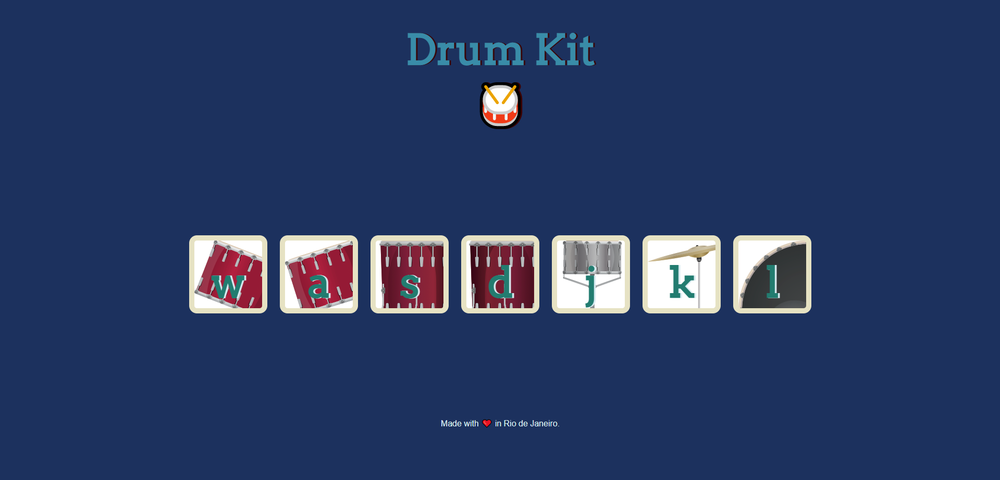

# Drum-Kit

## <h4 align="center"> Check de live project here ---> <a href="https://wpnnt.github.io/Drum-Kit/">Live Project</a> </h4>

## 💼 Tecnologias utilizadas

For the development of this website I used the following technologies:

- JavaScript  
- CSS5
- HTML

<h2> 🐱‍💻Autor</h2>
<table>
  <tr>
    <td align="center">
      <a href="https://github.com/Wpnnt">
         
        
          <b>Warph</b>
        
      </a>
    </td>
  </tr>
</table>
